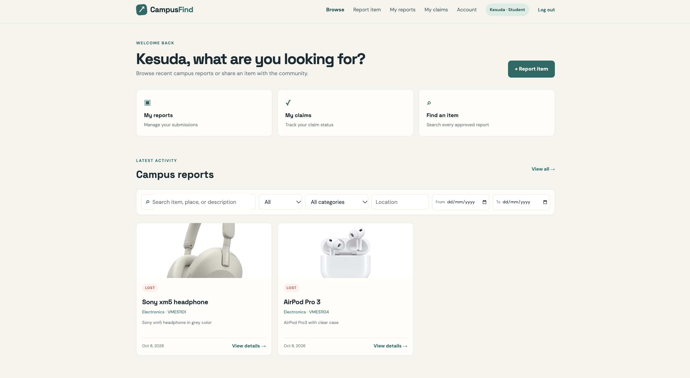
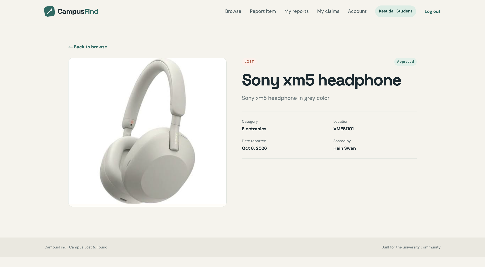
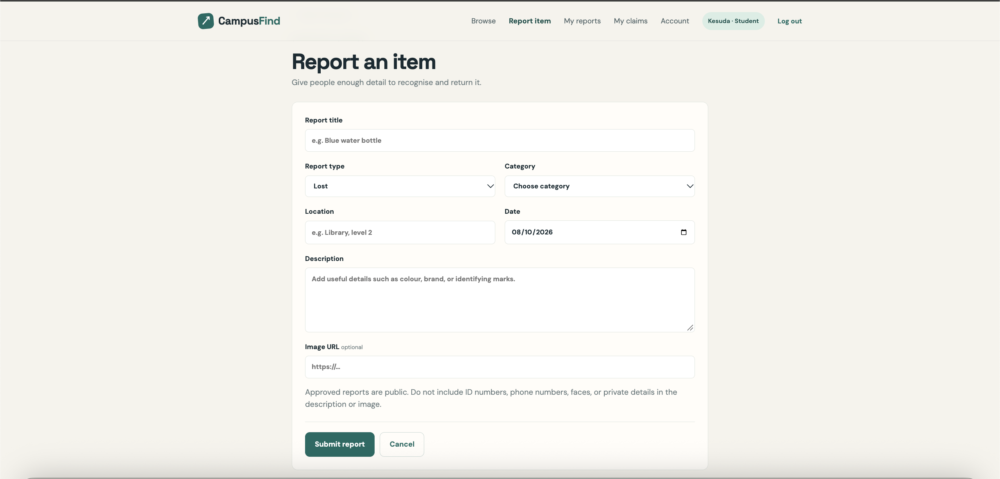
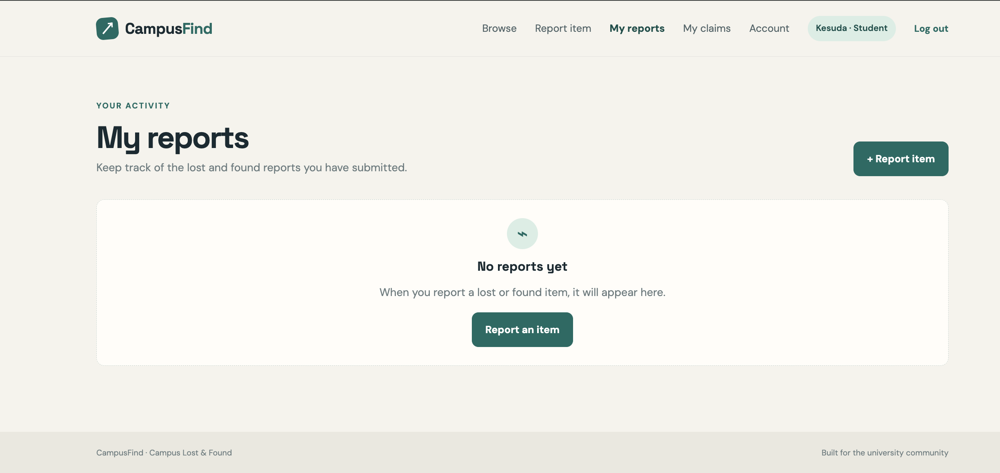
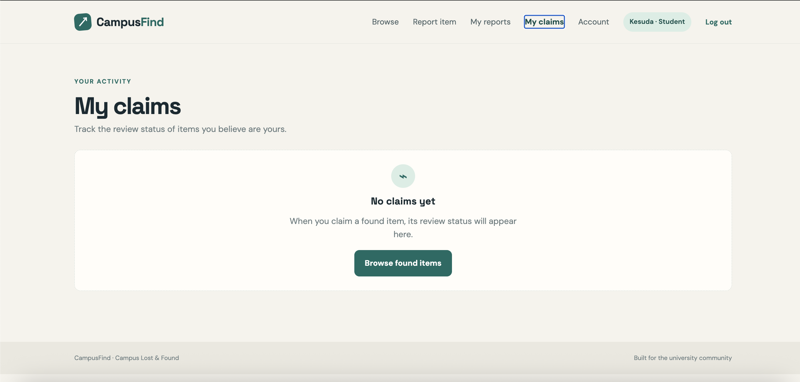
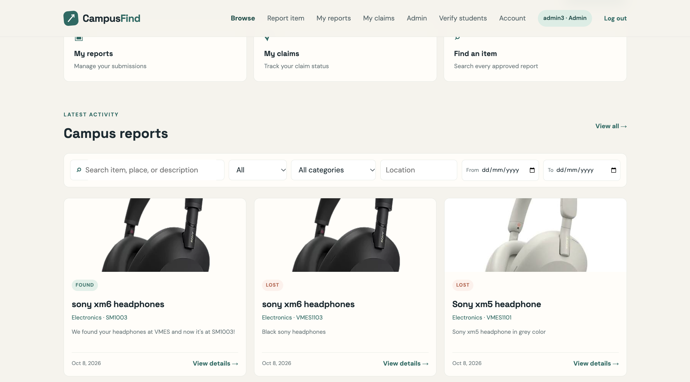
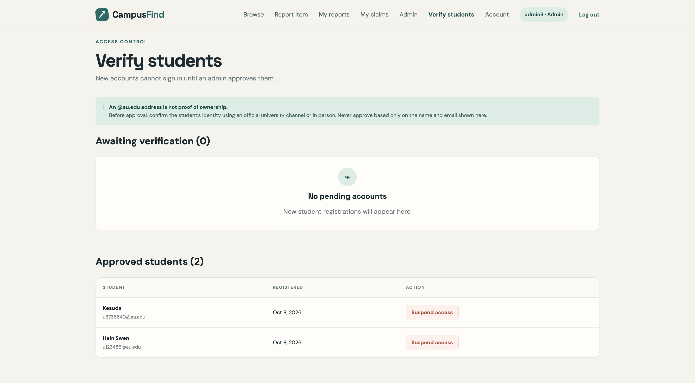
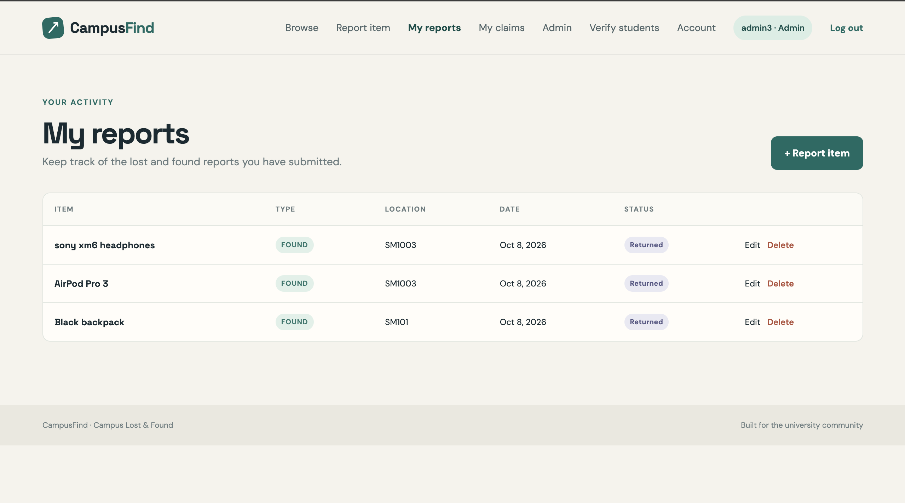

# Campus-Lost-and-Found

## Team Members

| Name | GitHub |
|---|---|
| Kesuda | [Kesuda814](https://github.com/Kesuda814) |
| Thwe Hnin Eain | [lycrois29](https://github.com/lycrois29) |
| Hein Nyan Swen | [Aitch-137](https://github.com/Aitch-137) |

---

## Project Description

**Campus-Lost-and-Found** is a web application designed to help university students report, search for, and recover lost items around campus.

Students can use the website to report items they have lost or found, browse available lost-and-found posts, and search for items based on relevant information such as the item name, category, and location.

The main goal of the project is to provide a simple and convenient platform where students can quickly connect with others who may have found their missing belongings. Instead of relying only on physical announcements or messages in different group chats, students can use one centralized platform to manage lost-and-found information.

The project is developed as a **Proof of Concept (POC) for a potential senior project**, with the aim of demonstrating how a centralized campus lost-and-found system could be developed and expanded in the future.

---

## Main Features

- Report a lost item
- Report a found item
- Browse lost-and-found items
- Search for items
- View detailed information about an item
- Update item information
- Delete item records
- Manage lost-and-found data through REST API
- Store application data using MongoDB

---

## Technology Stack

### Frontend

- Next.js
- React
- HTML
- CSS

### Backend

- Next.js
- REST API
- Node.js

### Database

- MongoDB

The project uses **Next.js and MongoDB** as required by the project specification. The backend is implemented using REST API endpoints for CRUD operations.

---

## Data Models

The system uses multiple entities to organize the application's data.

### 1. Item

Stores information about lost or found items.

Example information includes:

- Item name
- Category
- Description
- Location
- Status
- Date
- Contact information

### 2. User

Stores information about users who create lost-and-found posts.

Example information includes:

- Name
- Email
- Contact information

### 3. Report

Stores information related to lost-and-found reports.

Example information includes:

- Report type
- Item
- User
- Location
- Date
- Description

These entities are managed through REST API operations including **Create, Read, Update, and Delete (CRUD)**.

---

## REST API

The application provides REST API endpoints for managing the application's data.

The API supports CRUD operations such as:

- **GET** - Retrieve data
- **POST** - Create new data
- **PUT/PATCH** - Update existing data
- **DELETE** - Remove data

The REST API communicates with the MongoDB database to store and retrieve application data.

---

## Screenshots

### Student Features

#### 1. Student Dashboard


#### 2. Browse Lost-and-Found Items



#### 3. Item Details



#### 4. Report an Item



#### 5. My Reports



#### 6. My Claims



### Admin Features

#### 1. Admin Dashboard



#### 2. Verify Students



#### 3. Manage Campus Reports



## Project Structure

```text
Campus-Lost-and-Found/
│
├── app/
│   ├── api/
│   ├── ...
│
├── components/
│   └── ...
│
├── models/
│   └── ...
│
├── public/
│   └── ...
│
├── screenshots/
│   └── ...
│
├── README.md
├── package.json
└── ...
```

---

## Purpose as a Senior Project POC

This project serves as a Proof of Concept for a potential senior project.

The current system focuses on the core functionality required for a campus lost-and-found platform. In a future version, the system could be expanded with additional features such as improved search, notifications, authentication, image uploading, item matching, and more advanced user management.

The project demonstrates how a web-based system can be designed to solve a practical problem within a university environment using a modern web technology stack.

---

## Team

This project was developed as a group project by:

- **Kesuda**
- **Thwe Hnin Eain**
- **Hein Nyan Swen**

The project was developed collaboratively, with each team member responsible for different parts of the application.
